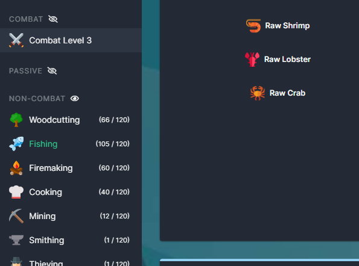
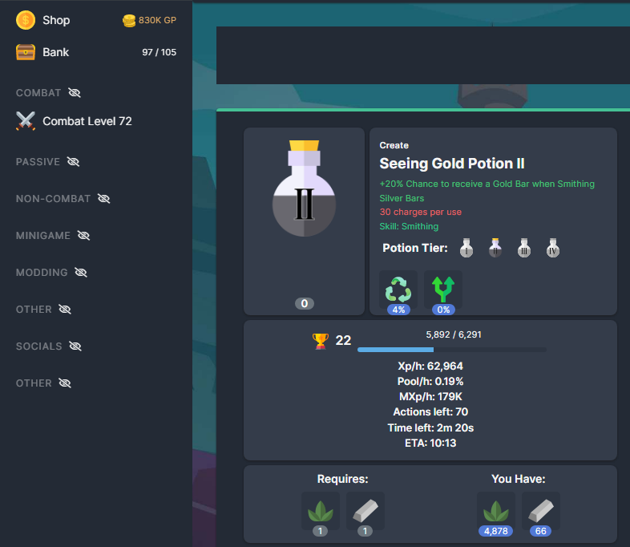
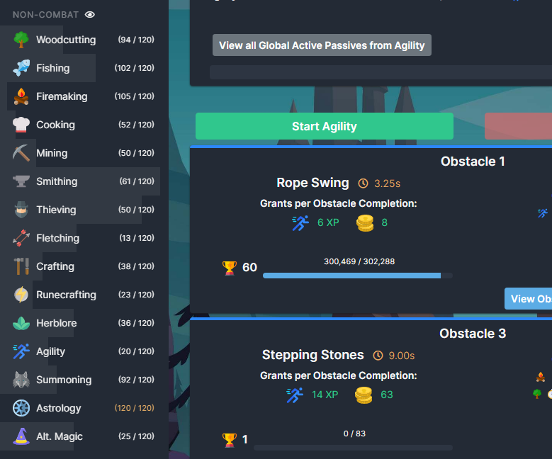
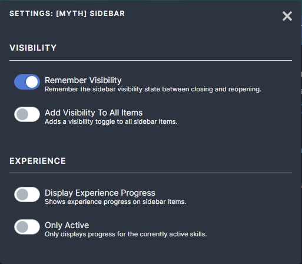

# [Myth] Sidebar

This mod contains the following features:

## Visibility

Remember the category toggled status between closing and re-opening the game. If you close a section and close the game. The next time you load the game it will remain closed.

You can also add a visibility toggle to all menu categories.

## Experience Progress

Display progress bars on the skill category so you can easily see how close you are to leveling up.

You can optionally configure the setting so that only currently active skills display the progress bar.

Progress does not show for skills above 120 as the game does not track the experience required for virtual level ups.

## Settings

All features of this mod can be enabled/disabled.

(default value)
* (enabled) Remember Visibility
* (disabled) Add Visibility To All Items
* (disabled) Display Experience Progress
* (disabled) Only Active
